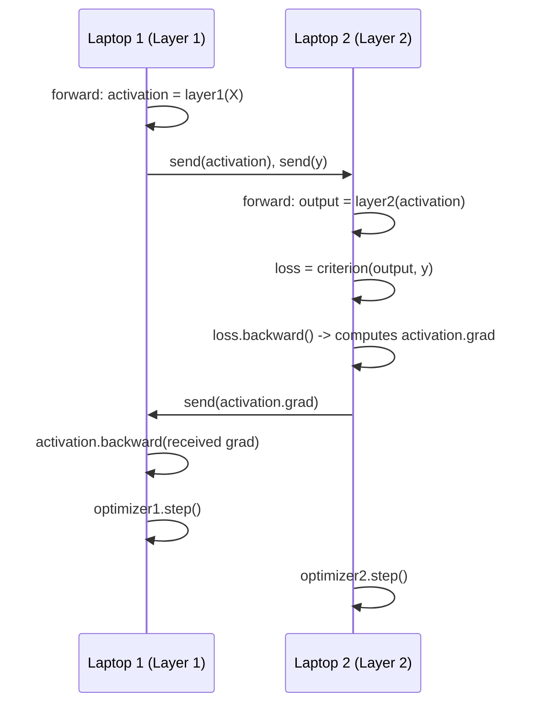

# Multi-Laptop Data Parallelism over Tailscale

**Keywords:** Tailscale (a tool that puts your devices on one private virtual network, even if they're on different Wi-Fi/networks, so they can reach each other by a stable IP), Rank (a number identifying which laptop is which in the training group — 0, 1, 2...), World size (total number of machines/processes taking part).

---

## What This Does

Runs real Data Parallelism (see `docs/02-data-parallelism.md`) across **two separate physical laptops**, each possibly on a completely different network (home Wi-Fi, office network, mobile hotspot — doesn't matter). Each laptop:

1. Holds a full, identical copy of the same tiny model.
2. Trains on its own slice of data.
3. Automatically syncs (averages) gradients with the other laptop after every step, using PyTorch's `DistributedDataParallel` (DDP).

Tailscale's job is just to give both laptops a private IP that can always reach each other, so you don't have to deal with router port-forwarding, firewalls, or public IPs.

This folder has **two versions**: Data Parallelism (`train_dp_*.py`, below) and Model Parallelism (`train_mp_*.py`, further down).

## Step 1: Install Tailscale on Both Laptops

1. Go to [tailscale.com/download](https://tailscale.com/download) and install it on both laptops.
2. Sign in with the **same Tailscale account** on both (this puts them on the same private network).
3. On each laptop, run:
   ```bash
   tailscale up
   ```
4. Get each laptop's Tailscale IP:
   ```bash
   tailscale ip -4
   ```
   You'll get something like `100.101.102.103`. Note down **Laptop 1's** IP — that's your `MASTER_ADDR`.

## Step 2: Install PyTorch on Both Laptops

```bash
pip install torch
```

(Same version on both laptops is best, to avoid compatibility issues.)

## Step 3: Edit Both Scripts

- In `train_dp_laptop1_rank0.py`, set `MASTER_ADDR` to **Laptop 1's own** Tailscale IP.
- In `train_dp_laptop2_rank1.py`, set `MASTER_ADDR` to **the same IP** (Laptop 1's IP) — Laptop 2 needs to know where to connect, not use its own IP.
- Both files must use the **same `MASTER_PORT`** (default `29500` in these scripts — change it in both files if that port is already used on Laptop 1).

## Step 4: Allow the Port Through Laptop 1's Firewall

Tailscale itself is usually enough (it creates a secure tunnel), but on some systems you may need to allow the chosen port (e.g. `29500`) through Laptop 1's local firewall for incoming connections. On Windows, allow it in Windows Defender Firewall; on Mac/Linux, allow it in your firewall tool if one is active.

## Step 5: Run Both Scripts

On **Laptop 1** (start this one first):
```bash
python train_dp_laptop1_rank0.py
```

Within a few seconds, on **Laptop 2**:
```bash
python train_dp_laptop2_rank1.py
```

Both scripts will print `Connected. World size = 2` once they find each other, then start training. You'll see loss values print from both laptops — that's each rank training on its own slice of data, with gradients quietly syncing between them over Tailscale after every step.

## Troubleshooting

| Problem | Likely Cause |
|---|---|
| Scripts hang forever on "Connected..." never appearing | `MASTER_ADDR` is wrong, or the port is blocked by a firewall. Double check the Tailscale IP with `tailscale ip -4` on Laptop 1. |
| Works on same Wi-Fi but not across networks | Tailscale isn't actually connected — run `tailscale status` on both laptops to confirm both show as online. |
| `RuntimeError: Address already in use` | Something else is using `MASTER_PORT` on Laptop 1 — pick a different port number in both files. |
| One laptop has a GPU, the other doesn't | That's fine — the scripts already auto-detect and use `cuda:0` if available, or fall back to CPU. DDP with the `gloo` backend supports this mix. |

## Scaling to More Than 2 Laptops

- Increase `WORLD_SIZE` in every script to the total number of laptops.
- Give each additional laptop the next `RANK` number (2, 3, 4...) in its own copy of the script.
- All laptops still point `MASTER_ADDR` at Laptop 1 (rank 0) — it stays the single coordinator that everyone connects through.

---

## Version 2: Model Parallelism Across Two Laptops

The scripts above (`train_dp_laptop1_rank0.py` / `train_dp_laptop2_rank1.py`) are **Data Parallelism** — both laptops hold a full, identical model copy.

`train_mp_laptop1_rank0.py` and `train_mp_laptop2_rank1.py` are different: **Model Parallelism** — each laptop holds a **different half of the same model**. Laptop 1 holds Layer 1, Laptop 2 holds Layer 2. No laptop ever has the whole model.

### Why This Needs Manual Send/Receive

In the CPU+GPU model-parallelism notebook (`notebooks/02-model-parallel-cpu-gpu-ann.ipynb`), moving data between devices with `.to(device)` was enough — PyTorch's autograd automatically tracked gradients across devices **because it was all one process**.

Across two separate laptops, that's not possible — there are two separate Python processes with no shared memory. So these scripts manually do what autograd would normally do automatically:

1. **Forward:** Laptop 1 computes Layer 1's output, then sends it (`dist.send`) to Laptop 2.
2. Laptop 2 receives it (`dist.recv`), marks it `requires_grad_(True)`, and computes Layer 2's output and the loss.
3. **Backward:** Laptop 2 calls `loss.backward()` locally — this also computes the gradient with respect to the *received* activation.
4. Laptop 2 sends that gradient (`dist.send`) back to Laptop 1.
5. Laptop 1 receives it (`dist.recv`) and calls `activation.backward(received_gradient)` to finish its own half of the backward pass.
6. Both laptops independently call `optimizer.step()` on their own half of the model.



### Running It

Same setup as before (Tailscale installed, IPs noted), but:

- Use a **different port** than the data-parallel scripts if running them separately (these default to `29501`).
- `BATCH_SIZE` and `HIDDEN_SIZE` must match **exactly** in both files — these determine the fixed tensor shapes used by `dist.send`/`dist.recv`, and a mismatch will hang or error.

```bash
# On Laptop 1:
python train_mp_laptop1_rank0.py

# On Laptop 2 (within a few seconds):
python train_mp_laptop2_rank1.py
```

You'll see loss values print on **both** laptops each epoch (Laptop 1 receives the loss just for logging; the real loss computation happens on Laptop 2, where the final layer and labels are).

### Data Parallelism vs. Model Parallelism Scripts — Quick Comparison

| | Data Parallel scripts | Model Parallel scripts |
|---|---|---|
| What each laptop holds | Full model copy | Different half of the model |
| What's exchanged | Gradients (averaged) | Activations (forward) + gradients (backward) |
| Mechanism | `DistributedDataParallel` (automatic) | `dist.send` / `dist.recv` (manual) |
| Each laptop's own data | Different data slice | Only Laptop 1 has the input data |
| Failure impact | Losing one laptop = losing one copy, others continue | Losing either laptop breaks the whole pipeline (see `docs/11-fault-tolerance.md`) |

---

**Related docs:** [02-data-parallelism.md](../docs/02-data-parallelism.md) · [10-all-reduce-and-network.md](../docs/10-all-reduce-and-network.md) · [11-fault-tolerance.md](../docs/11-fault-tolerance.md)
