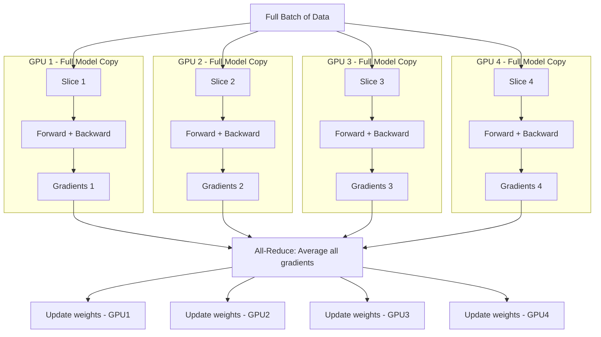

# 02. Data Parallelism

**Keywords used in this file:** Gradient (a number that tells the model which direction to adjust a weight, and by how much), Optimizer state (extra numbers the training algorithm keeps to adjust weights smartly, like momentum), Synchronize (making sure all copies agree/match before moving on), Replica (an identical copy of the full model).

---

## The Core Idea

Copy the **entire model** onto every GPU. Give each GPU a **different slice of the batch**. Each GPU computes gradients on its own slice, then all GPUs **combine (average) their gradients** before updating weights, so every copy stays identical.

## Architecture

## Step by Step

1. Copy the model onto every GPU (all copies are identical at the start).
2. Split one big batch into smaller pieces, one piece per GPU.
3. Each GPU runs the forward pass (make a prediction) and backward pass (compute gradients) on its own piece, fully independently.
4. All GPUs share their gradients and average them (this step is called **All-Reduce**, covered in file 06).
5. Every GPU applies the same averaged gradient to its own copy of the model.
6. Because step 5 is identical everywhere, all copies stay in sync, and the loop repeats.

## Simple Example

Imagine training on a batch of 1,024 images with 4 GPUs.

- Each GPU gets 256 images.
- Each GPU computes its own gradient using its 256 images.
- All 4 gradients are averaged together — this is mathematically the same as if one giant GPU had processed all 1,024 images at once.
- All 4 GPUs update their weights using this averaged gradient.

## When To Use It

- Your **model fits comfortably in one GPU's memory**, including gradients and optimizer states.
- You want to **train faster** by processing more data at the same time.
- This is the easiest form of parallelism to set up, and is the default starting point for most training jobs.

## When NOT To Use It

- The model itself is too big to fit on a single GPU, even with a tiny batch size (batch size of 1). Data parallelism alone can't fix this — you need model, tensor, or pipeline parallelism instead.
- You have very few GPUs and a very slow network — the all-reduce step (syncing gradients) can become the bottleneck if the network is weak and the model has huge numbers of weights.

## The Catch: Memory Is Not Saved

Data parallelism does **not** reduce memory usage per GPU. Every single GPU still needs to hold:

- The full model
- The full gradients
- The full optimizer states

So if a model doesn't fit on one GPU today, adding 100 more GPUs with pure data parallelism will not help — you'd just have 100 GPUs each still unable to fit it. This is exactly why the next files (model, tensor, pipeline parallelism) exist.

---

**Next:** [03. Model Parallelism](./03-model-parallelism.md)
