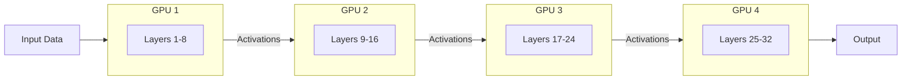

# 03. Model Parallelism

**Keywords used in this file:** Layer (one processing step inside a neural network, data flows through many layers one after another), Activation (the output numbers produced by a layer, passed to the next layer), Bottleneck (the slowest part of a system, which slows everything else down).

---

## The Core Idea

Instead of copying the whole model everywhere (like data parallelism), we **cut the model itself into pieces** — usually by layers — and place each piece on a different GPU. No single GPU ever sees the full model.

## Architecture



## Step by Step

1. Split the model's layers into groups (e.g., layers 1-8, 9-16, 17-24, 25-32).
2. Put each group of layers on its own GPU.
3. Data flows in one direction: GPU 1 finishes its layers, sends the output (activations) to GPU 2, and so on until the last GPU produces the final output.
4. During training, the same happens in reverse for the backward pass — gradients flow backward through the GPUs, from the last GPU to the first.

## Simple Example

A 32-layer model does not fit on one 24GB GPU. Split it across 4 GPUs, 8 layers each:

- GPU 1 holds layers 1-8, only needs enough memory for those 8 layers.
- GPU 1 processes the input, then sends its output to GPU 2.
- GPU 2 holds layers 9-16, processes what GPU 1 sent, sends result to GPU 3.
- This continues until GPU 4 produces the final answer.

Now each GPU only needs roughly 1/4 of the memory the full model would need.

## When To Use It

- The model **does not fit** on a single GPU, even with the smallest batch size.
- You have GPUs connected with a **reasonably fast link** (like NVLink or a fast network), since GPUs must constantly pass data to each other.

## When NOT To Use It

- If the model fits on one GPU, don't bother — model parallelism adds communication overhead and complexity for no benefit.
- If your GPUs are connected with a **slow network**, this approach can be very slow, because GPU 2 must literally wait for GPU 1 to finish before it can start (see "The Idle GPU Problem" below).

## The Idle GPU Problem

Plain model parallelism has a big weakness: at any moment, **only one GPU is actually working**, while the others sit idle, waiting their turn.

```
Time:  1        2        3        4
GPU1:  [work]   idle     idle     idle
GPU2:  idle     [work]   idle     idle
GPU3:  idle     idle     [work]   idle
GPU4:  idle     idle     idle     [work]
```

This wastes a lot of GPU time. Pipeline Parallelism (file 05) fixes exactly this problem by overlapping work from multiple batches.

## How Do You Decide Where To Cut The Layers?

This is a common real-world question. Here's how it's usually decided:

- **Equal memory split (most common):** Measure how much memory each layer needs, then split so each GPU gets roughly equal memory usage. Not always equal layer *count*, because some layers (like the embedding layer, or attention layers with huge internal matrices) use much more memory than others.
- **Equal compute split:** If your goal is speed, not memory, split so each GPU takes roughly the same *time* to compute its layers, so no GPU finishes early and waits around.
- **Match GPU power to layer difficulty:** If you have a mix of GPUs (say, some older/weaker, some newer/stronger — a common situation), give the weaker GPUs fewer layers or the simpler/lighter layers, and give the stronger GPUs the heavier, more complex ones (layers with big matrix multiplications, like attention layers in large models).
- **Watch out for the biggest single layer:** A GPU must be able to fit at least the single largest layer assigned to it, plus its activations. If one layer alone (like a huge output layer) is bigger than a weak GPU's memory, that GPU cannot be given that layer at all, regardless of even splitting.

### Special Case: Low-Power / Small GPUs

If you're working with smaller or older GPUs (less memory, less compute power):

- Give them fewer layers, or the "cheaper" layers (simple ones, not the huge matrix-multiplication-heavy ones).
- Expect them to become the bottleneck — the whole pipeline moves at the speed of the slowest GPU, so balance is more important than perfectly equal layer counts.

### Special Case: Layers With Heavy Matrix Multiplication

Some layers (especially attention layers and large fully-connected layers) involve very large matrix multiplications. These layers:

- Need more memory just for temporary calculation space.
- Take more time to compute.
- Are strong candidates to be split further using **Tensor Parallelism** (next file), instead of just placed whole on one GPU.

---

**Next:** [04. Tensor Parallelism](./04-tensor-parallelism.md)
