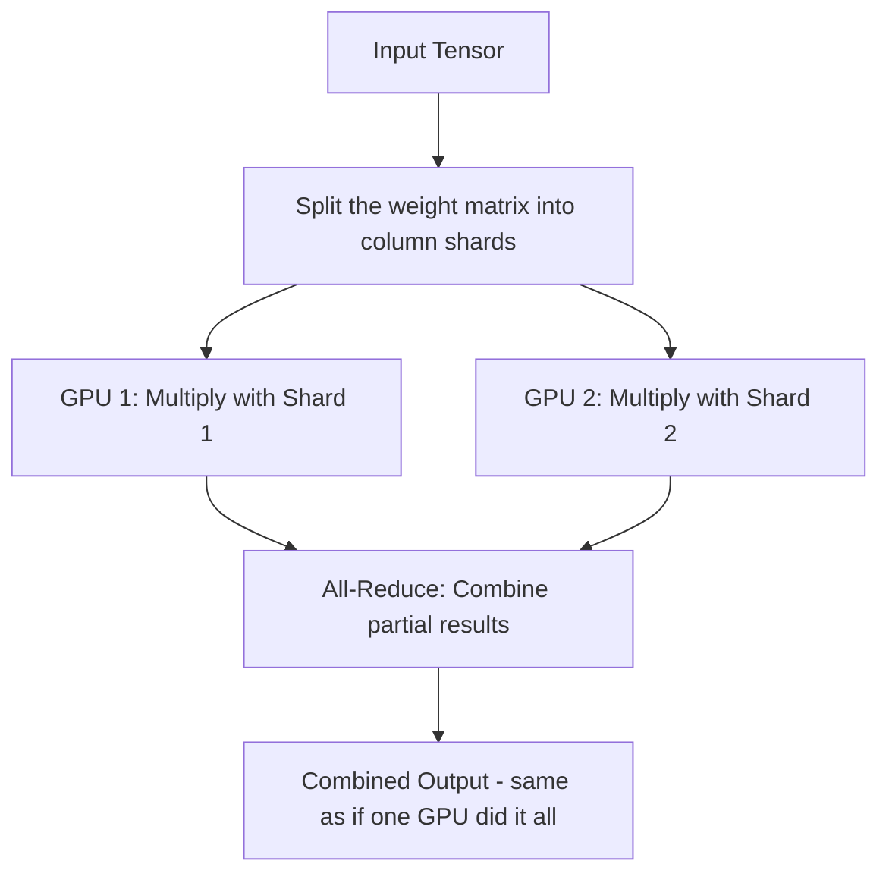

# 04. Tensor Parallelism

**Keywords used in this file:** Tensor (a fancy name for a grid of numbers — a matrix, but can have more dimensions), Matrix multiplication (the core math operation of neural networks, multiplying two grids of numbers together), Shard (one piece of something that has been split up).

---

## The Core Idea

Model Parallelism splits the model layer by layer. Tensor Parallelism goes one level deeper: it splits **a single layer's math operation** across multiple GPUs. Each GPU computes a piece of the same matrix multiplication, at the same time.

## Architecture

## Step by Step

1. Take one layer's weight matrix (say, a huge matrix used in an attention or fully-connected layer).
2. Cut this single matrix into pieces (shards) — for example, split its columns in half.
3. Send the **same input** to every GPU, but each GPU only holds one shard of the weight matrix.
4. Each GPU does its own smaller matrix multiplication, in parallel, at the same time (no waiting for each other).
5. Combine the partial outputs (usually with an all-reduce or a concatenation) to get the exact same result as if one giant GPU had done the whole multiplication.

## Simple Example

A weight matrix is 8,000 x 8,000 numbers — too big to comfortably fit and compute on one GPU alongside everything else.

- Split it into 2 pieces by columns: GPU 1 gets columns 1-4,000, GPU 2 gets columns 4,001-8,000.
- Both GPUs receive the same input.
- GPU 1 multiplies input x (its half of the matrix), GPU 2 does the same with its half.
- The two partial results are combined into the final, correct output — mathematically identical to doing it on one GPU.

## When To Use It

- A **single layer** is too big to fit or compute efficiently on one GPU (common in very large models with huge attention layers).
- You have a **very fast connection** between GPUs (like NVLink within one machine), because tensor parallelism requires GPUs to communicate *very frequently* — after nearly every layer, not just occasionally.

## When NOT To Use It

- Your GPUs are connected over a **slow network** (like a normal network between separate machines). Tensor parallelism needs constant, fast back-and-forth communication, so a slow link kills performance.
- Your model's layers are small enough to fit fine — splitting a small matrix into pieces just adds communication overhead for no real benefit.

## Model Parallelism vs. Tensor Parallelism (Don't Confuse Them)

| | Model Parallelism | Tensor Parallelism |
|---|---|---|
| What is split | Different layers | One layer's matrix |
| GPUs work at same time? | No, one after another | Yes, at the same time |
| Communication frequency | Once per group of layers | Very frequent, inside a single layer |
| Best network requirement | Medium/fast | Very fast (like NVLink) |
| Best used for | Splitting across machines | Splitting across GPUs in the same machine |

A simple rule of thumb used in real systems: **use tensor parallelism between GPUs in the same physical machine** (fast link), and **use model or pipeline parallelism between separate machines** (slower link).

---

**Next:** [05. Pipeline Parallelism](./05-pipeline-parallelism.md)
