# 05. Pipeline Parallelism

**Keywords used in this file:** Micro-batch (a small piece of a batch, made even smaller than a normal split, just to keep the pipeline moving), Bubble (wasted idle time in a pipeline, where a GPU has nothing to do), Stage (one section of the model, assigned to one GPU, same idea as a group of layers in model parallelism).

---

## The Core Idea

Pipeline Parallelism starts from Model Parallelism's layer-split idea, but fixes its biggest weakness (GPUs sitting idle). It does this by splitting the **batch** into smaller micro-batches and streaming them through the GPUs like an assembly line, so multiple GPUs are working at the same time on different micro-batches.

## Architecture

```mermaid
gantt
    title Pipeline Parallelism Timeline (4 GPUs, 4 micro-batches)
    dateFormat X
    axisFormat %s
    section GPU1 (Stage 1)
    micro-batch 1 :a1, 0, 1
    micro-batch 2 :a2, 1, 1
    micro-batch 3 :a3, 2, 1
    micro-batch 4 :a4, 3, 1
    section GPU2 (Stage 2)
    idle :done, 0, 1
    micro-batch 1 :b1, 1, 1
    micro-batch 2 :b2, 2, 1
    micro-batch 3 :b3, 3, 1
    section GPU3 (Stage 3)
    idle :done, 0, 2
    micro-batch 1 :c1, 2, 1
    micro-batch 2 :c2, 3, 1
    section GPU4 (Stage 4)
    idle :done, 0, 3
    micro-batch 1 :d1, 3, 1
```



## Step by Step

1. Split the model into stages across GPUs, same as Model Parallelism (GPU 1 = layers 1-8, GPU 2 = layers 9-16, etc.).
2. Split one batch into several smaller **micro-batches** (e.g., a batch of 256 becomes 8 micro-batches of 32).
3. Feed micro-batches into the pipeline one after another, without waiting for the previous one to fully finish.
4. While GPU 1 works on micro-batch 2, GPU 2 is already working on micro-batch 1 (which GPU 1 already finished). This overlap is the whole point.
5. This keeps most GPUs busy most of the time, instead of the "one GPU works, rest are idle" problem from plain Model Parallelism.

## Simple Example (Assembly Line)

Think of a car factory with 4 stations: paint, engine, wheels, final check.

- Without pipelining: Station 1 paints car #1, then everyone waits while nothing else happens, then station 2 starts, etc. Very wasteful.
- With pipelining: Station 1 paints car #1, then *immediately* starts painting car #2, while station 2 now installs the engine on car #1. All 4 stations become busy at the same time, working on different cars.

## The Bubble Problem

Pipeline parallelism is much better than plain model parallelism, but it's not perfect. At the very start (filling the pipeline) and the very end (draining the pipeline), some GPUs are still idle. This wasted time is called a **bubble**.

```
Start:  GPU1 busy, GPU2/3/4 idle (pipeline filling up)
Middle: All GPUs busy (best case)
End:    GPU1 idle, GPU2/3/4 still finishing (pipeline draining)
```

**More micro-batches = smaller bubble percentage.** If you only use 2 micro-batches, the bubble is a huge chunk of total time. If you use 32 micro-batches, the bubble becomes a small fraction of total time. This is why real systems use many small micro-batches, not just 2-4.

## When To Use It

- The model is too large for one GPU (same reason as Model Parallelism), **and** you want better GPU utilization than plain Model Parallelism gives you.
- You're connecting GPUs **across machines**, where tensor parallelism's constant chatter would be too slow, but you still want decent efficiency.

## When NOT To Use It

- Very small models that fit on one GPU — no need to add this complexity.
- Very small batch sizes that can't be broken into enough micro-batches — the bubble will dominate and you'll lose most of the benefit.

---

**Next:** [06. Hybrid #1: Model + Pipeline Parallelism](./06-hybrid-model-pipeline.md)
