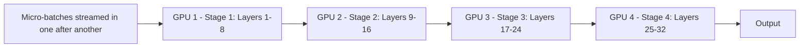

# 06. Hybrid #1: Model + Pipeline Parallelism

**Keywords used in this file:** Stage (a group of layers assigned to one GPU — same thing whether we call it "model parallelism" or "pipeline parallelism"), Micro-batch (a small piece of a batch, used to keep a pipeline busy, explained fully in file 05).

---

## Why This Combo First?

This is the **simplest hybrid**, because Model Parallelism and Pipeline Parallelism are really the same idea at their core (split the model into stages across GPUs) — Pipeline Parallelism just adds micro-batching on top of Model Parallelism to reduce idle time. So combining them isn't really "combining two different things," it's more like "using Model Parallelism's layer split, done the smart way, with pipelining."

Because of this, some people don't even count this as a true hybrid — but it's the right first step before mixing in Tensor or Data Parallelism, since you must decide how to split layers into stages before anything else.

## The Idea

1. Split the model into stages by layers (Model Parallelism's core idea).
2. Instead of sending one full batch through and leaving most GPUs idle, split the batch into micro-batches and stream them through the stages (Pipeline Parallelism's fix).

## Architecture



Timing view (compare to file 03's "one-GPU-at-a-time" diagram — this is the fix):

```
Time:   1     2     3     4     5     6     7
GPU1:  mb1   mb2   mb3   mb4   idle  idle  idle
GPU2:  idle  mb1   mb2   mb3   mb4   idle  idle
GPU3:  idle  idle  mb1   mb2   mb3   mb4   idle
GPU4:  idle  idle  idle  mb1   mb2   mb3   mb4
```//`mb` = micro-batch

## Simple Example

A 32-layer model, split into 4 stages of 8 layers each, across 4 GPUs. A batch of 256 samples is split into 8 micro-batches of 32 samples each. Instead of GPU 1 finishing all 256 samples before GPU 2 starts anything, GPU 1 finishes micro-batch 1 (32 samples) and immediately hands it to GPU 2, then starts micro-batch 2. By the third or fourth micro-batch, all 4 GPUs are busy at the same time.

## When To Use It

- Model is too big for one GPU (can't be solved by Data Parallelism alone).
- You have a fast-enough connection between the GPUs holding different stages (doesn't need to be as fast as Tensor Parallelism needs, since communication only happens at stage boundaries, not inside every layer).

## When NOT To Use It

- If a **single layer** itself is too big (not just the whole model) — this combo doesn't help with that; you need Tensor Parallelism for that specific problem (next file).
- Very small batch sizes that can't be split into enough micro-batches — the pipeline "bubble" (idle time at the start/end) will eat most of your benefit.

---

**Next:** [07. Hybrid #2: Tensor + Pipeline Parallelism](./07-hybrid-tensor-pipeline.md)
