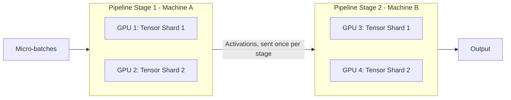

# 07. Hybrid #2: Tensor + Pipeline Parallelism

**Keywords used in this file:** Intra-node (happening inside one machine, between GPUs on the same box), Inter-node (happening between separate machines).

---

## Why This Combo Next?

File 06 fixed the "GPUs sit idle" problem using pipelining. But it still assumes every single layer fits fine on one GPU. What if even **one layer** is too big or too heavy to compute efficiently on a single GPU? That's exactly what Tensor Parallelism solves (file 04). This file combines the two: split single layers with Tensor Parallelism, and split the model into stages with Pipeline Parallelism.

## The Idea

1. Group layers into pipeline stages (like before).
2. Inside each stage, if the layers are too heavy for one GPU, split them further using Tensor Parallelism, across a small group of GPUs that share a fast connection.
3. Stream micro-batches through the pipeline stages, same as file 06.

## Architecture

## The Key Rule: Match Communication Type to Link Speed

This combo only works well if you place things correctly:

- **Tensor Parallelism → intra-node** (inside Machine A: GPU 1 and GPU 2, connected by NVLink or similar fast link). Tensor Parallelism talks *constantly* (once per layer), so it needs the fastest link available.
- **Pipeline Parallelism → inter-node** (between Machine A and Machine B, a normal network). Pipeline Parallelism only talks *once per stage boundary*, so a slower network is tolerable here.

If you get this backwards (Tensor Parallelism spread across machines on a slow network), performance collapses, because every single layer now waits on slow network round-trips.

## Simple Example

You have 2 machines, each with 2 GPUs connected by NVLink:

- Machine A = Pipeline Stage 1. Its 2 GPUs use Tensor Parallelism to split each layer's matrix in half.
- Machine B = Pipeline Stage 2. Same setup, its own Tensor Parallelism pair.
- Micro-batches flow: Machine A finishes a micro-batch's stage-1 computation (using both its GPUs together), sends the result over the network to Machine B, and immediately starts the next micro-batch.

## When To Use It

- The model is too big for one GPU (needs staging), **and** at least some individual layers are too big/heavy for a single GPU too (needs tensor splitting).
- You have machines with fast intra-node links (for tensor) and are willing to accept normal inter-node links (for pipeline).

## When NOT To Use It

- If no single layer is a problem — plain Model + Pipeline Parallelism (file 06) is simpler and has less communication overhead.
- If your machines don't have a fast intra-node link (e.g., GPUs on the same machine are connected no better than GPUs on separate machines) — Tensor Parallelism won't have anywhere fast to run, and should probably be skipped.

---

**Next:** [08. Hybrid #3: Tensor + Model + Pipeline Parallelism](./08-hybrid-tensor-model-pipeline.md)
