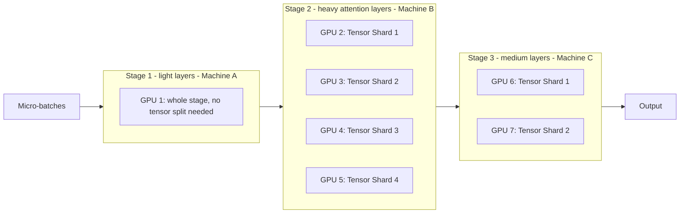

# 08. Hybrid #3: Tensor + Model + Pipeline Parallelism

**Keywords used in this file:** Uneven split (dividing work into pieces that are not all the same size, done on purpose to match hardware differences), Group (a set of GPUs assigned to work together on the same piece of the model).

---

## Why This Combo Next?

File 07 assumed every pipeline stage looks the same — same number of layers, same tensor-parallel size. In real clusters, this is often not true. Some parts of a model are heavier than others (like layers with huge attention matrices), and some GPUs are stronger than others. This file adds **Model Parallelism's flexible, uneven layer-splitting** on top of Tensor + Pipeline, so each stage can be sized and split differently based on what it actually needs.

## The Idea

1. Use **Model Parallelism's approach** first: decide where to cut the model into stages, but do it **unevenly** — based on memory and compute needs of each layer group, not just equal layer counts (see file 03's layer-division rules).
2. Turn each stage into a **Pipeline stage**, streaming micro-batches through them.
3. Inside any stage that's still too heavy for one GPU, apply **Tensor Parallelism**, using a differently-sized GPU group per stage if needed (e.g., a heavy stage might use 4 GPUs for tensor splitting, while a light stage only needs 1).

## Architecture

Notice the stages are **not symmetric** — Stage 1 uses 1 GPU, Stage 2 uses 4 GPUs (because its layers are heavy), Stage 3 uses 2 GPUs. This is the whole point of bringing Model Parallelism's flexible thinking back in: real models are not made of identical, equal-sized layers, so forcing every stage to look the same wastes hardware.

## Simple Example

A model has an early section of small, light layers, a middle section with huge attention layers, and a late section of medium layers.

- Stage 1 (light layers): fits on 1 GPU alone, no need for tensor splitting.
- Stage 2 (huge attention layers): needs 4 GPUs, tensor-split, because these layers alone are too heavy for one GPU.
- Stage 3 (medium layers): needs 2 GPUs, tensor-split.

Total: 1 + 4 + 2 = 7 GPUs used, matched to actual layer weight, not an equal 1/3-1/3-1/3 split.

## When To Use It

- Your model has clearly uneven layers — some sections much heavier (bigger matrices, more compute) than others. This is common in many modern large models.
- You have a mix of GPU group sizes available and want to avoid wasting hardware on light stages while starving heavy stages.

## When NOT To Use It

- Your model's layers are fairly uniform in size and cost — in that case, file 07's simpler, evenly-split Tensor + Pipeline combo is easier to build and maintain, with no real benefit lost.
- You don't have the tooling or time to carefully profile which layers are heavy — guessing wrong at an uneven split can make things worse than a simple even split.

---

**Next:** [09. Hybrid #4: Full 3D Parallelism (Tensor + Pipeline + Data)](./09-hybrid-full-3d-with-data.md)
