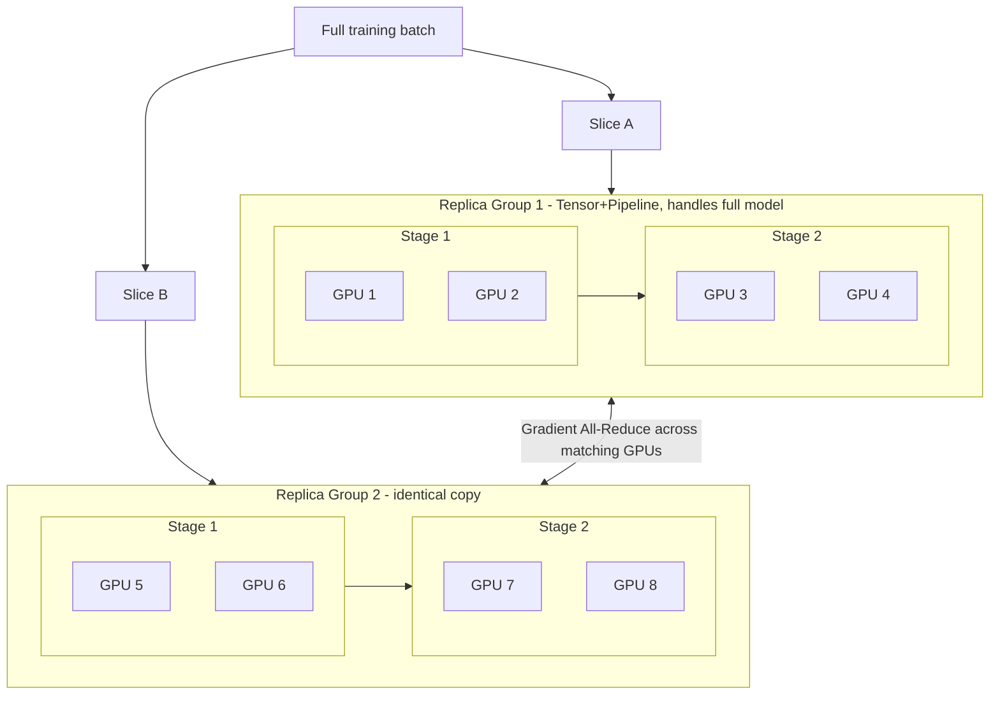

# 09. Hybrid #4: Full 3D Parallelism (Tensor + Pipeline + Data)

**Keywords used in this file:** Replica group (one complete copy of the entire tensor+pipeline setup, treated as a single unit for data parallelism), World size (the total number of GPUs used across the whole job).

---

## Why This Combo Last?

Files 06-08 all focus on one goal: **fitting a huge model onto GPUs at all**, by splitting the model itself (stages via pipeline, single layers via tensor, uneven sizing via model-style splitting). None of that, by itself, makes training **faster** by processing more data at once — it only makes it *possible*. This final combo adds **Data Parallelism** on top of everything from files 06-08, to get both: a model that fits, and speed from processing more data in parallel. This is the most complete, most complex setup, and is what real large-scale training clusters actually run.

## The Idea

1. Build one complete "unit" using Tensor + Pipeline (+ uneven Model-style splitting if needed) — this unit alone can hold and run the entire model, split across some number of GPUs. Call this a **replica group**.
2. Make **multiple identical copies** of this entire replica group, using Data Parallelism — each copy processes a different slice of data.
3. After each step, all replica groups synchronize their gradients (All-Reduce, file 10), just like plain Data Parallelism, except now each "GPU" in that all-reduce is really a whole group of GPUs working together.

## Architecture

## Simple Example

You have 8 GPUs total, arranged as 4 machines with 2 GPUs each:

- **Tensor Parallelism size = 2** — the 2 GPUs on each machine split each layer's matrix.
- **Pipeline Parallelism size = 2** — 2 machines form one pipeline (Stage 1, Stage 2), making one replica group of 4 GPUs total.
- **Data Parallelism size = 2** — you have 8 GPUs total, and each replica group uses 4, so you can fit exactly 2 replica groups, each handling different data.

World size = Tensor (2) x Pipeline (2) x Data (2) = 8 GPUs — matches your hardware exactly. This is the same math shown in the earlier hybrid overview, but now built up step by step from files 06 through 08.

## When To Use It

- You have a genuinely large model **and** enough spare GPUs left over after fitting one copy of the model, to duplicate the whole setup for more speed.
- This is the standard approach for training very large models (like large language models) across hundreds or thousands of GPUs.

## When NOT To Use It

- You don't have enough GPUs to even duplicate the model once — in that case, stop at whichever combo from files 06-08 lets the model fit, and don't force Data Parallelism in with too few resources.
- Your training job isn't speed-limited by GPU count in the first place (e.g., you're limited by how fast data can be loaded from disk) — adding more replica groups won't help if the real bottleneck is elsewhere.

## Full Comparison of All Hybrid Combos

| File | Combo | Solves | Needs |
|---|---|---|---|
| 06 | Model + Pipeline | Whole model too big, GPUs idle | Medium-fast links between stages |
| 07 | Tensor + Pipeline | Whole model too big AND single layers too big | Fast intra-node link + normal inter-node link |
| 08 | Tensor + Model + Pipeline | Same as 07, but layers are uneven in size | Same as 07, plus careful profiling of layer weight |
| 09 | Tensor + Pipeline + Data (Full 3D) | Everything above, plus training speed | Everything above, plus spare GPUs to duplicate the setup |

---

**Next:** [10. All-Reduce and Network Communication](./10-all-reduce-and-network.md)
