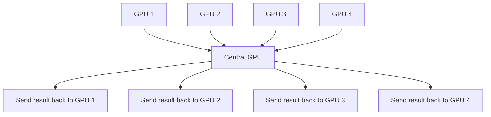
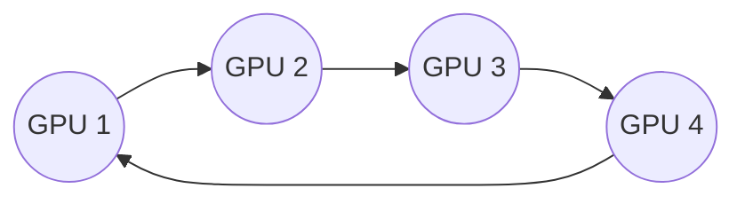

# 10. All-Reduce and Network Communication

**Keywords used in this file:** Bandwidth (how much data can move through a connection per second), Latency (how long it takes for the first bit of data to arrive, even before considering size), Ring (an arrangement where each GPU only talks to its two neighbors, forming a circle), NCCL (a library made by NVIDIA that handles fast GPU-to-GPU communication, pronounced "nickel").

---

## What Problem Is All-Reduce Solving?

In Data Parallelism (file 02), every GPU computes its own gradient. Before updating weights, all GPUs need to end up with the **same averaged gradient**. All-Reduce is the operation that does this: it takes numbers spread across many GPUs and gives every GPU the combined (usually averaged) result.

## The Naive (Bad) Way: One Central Collector

This works but the central GPU becomes a **bottleneck** — it has to receive data from everyone, then send it back to everyone. As you add more GPUs, this one GPU does more and more work while others just wait.

## The Better Way: Ring All-Reduce

Instead of one central collector, GPUs are arranged in a **ring** (a circle), and each GPU only ever talks to its two neighbors.

### How It Works (Simplified)

1. Each GPU splits its gradient data into small chunks.
2. In each step, a GPU sends one chunk to its next neighbor, and receives a chunk from its previous neighbor, at the same time.
3. Over several steps, chunks travel all the way around the ring, and along the way, each GPU adds the chunk it receives to its own matching chunk.
4. After going around once (summing), a second pass shares the fully-summed chunks back around the ring, so every GPU ends up with the complete, identical result.

### Why This Is Better

- No single GPU is a bottleneck — every GPU does a similar, small amount of work, talking only to its neighbors.
- The total data sent by each GPU does not grow much even as you add more GPUs, so it scales well to large clusters.

## Bandwidth vs. Latency: Both Matter

- **Bandwidth** matters most when your data (like a huge model's gradients) is large — more bandwidth means bulk data moves faster.
- **Latency** matters most when you do communication very frequently in small chunks — like Tensor Parallelism, which needs to sync after nearly every layer. Even if the connection is high-bandwidth, if it's slow to "start" each transfer, frequent small syncs suffer.

This is exactly why:

- **Tensor Parallelism** needs low-latency, high-bandwidth links (NVLink, inside one machine).
- **Data Parallelism**'s all-reduce, which happens once per batch (not once per layer), can tolerate a somewhat slower network between machines.

## Real Tools That Do This

- **NCCL** (NVIDIA Collective Communications Library) — handles ring all-reduce and similar operations efficiently between NVIDIA GPUs, whether on one machine or across many.
- Frameworks like PyTorch's `DistributedDataParallel` and DeepSpeed use NCCL underneath, so you usually don't write the ring logic yourself — you just tell the framework how many GPUs/nodes you have.

## Summary Table

| Communication Pattern | Used By | Frequency | Network Need |
|---|---|---|---|
| All-Reduce (gradients) | Data Parallelism | Once per batch | Medium-fast |
| All-Reduce (partial outputs) | Tensor Parallelism | Once per layer (very often) | Very fast, low latency |
| Point-to-point send/receive (activations) | Model / Pipeline Parallelism | Once per stage boundary | Medium |

---

**Next:** [11. Fault Tolerance](./11-fault-tolerance.md)
