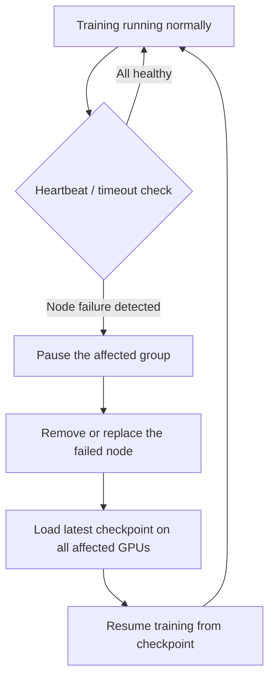

# 11. Fault Tolerance: What Happens When a Node Fails?

**Keywords used in this file:** Checkpoint (a saved snapshot of the model and training progress, so you can resume later instead of starting over), Heartbeat (a small, regular signal a machine sends to say "I'm still alive"), Timeout (giving up on waiting for a response after a certain amount of time).

---

## Why This Matters

The more GPUs and machines you use, the more likely it is that **something** breaks during a long training run — a GPU overheats, a machine loses network connection, a power supply fails, or software crashes. With thousands of GPUs running for weeks, failures are not rare edge cases — they are expected and normal events.

## How Do We Know a Node Has Failed?

1. **Heartbeats** — Each machine regularly sends a small "I'm alive" signal to a coordinator (a manager process) or to its neighbors. If a heartbeat is missed for too long, the system assumes that machine has failed.
2. **Timeouts during communication** — If a GPU is waiting for data from another GPU (say, in an all-reduce step or a pipeline stage) and no response comes within an expected time window, this signals a likely failure.
3. **Health-check processes** — Separate monitoring tools (like NVIDIA's DCGM, or cluster schedulers like Kubernetes or Slurm) actively check GPU temperature, memory errors, and process status, and can flag a machine as unhealthy before it fully fails.

## What Happens Depends On the Type of Parallelism

### In Data Parallelism

If one GPU (one replica) fails:

- All other GPUs are waiting for its gradient in the all-reduce step, so the **entire training run stalls**, not just that one GPU.
- Recovery: remove the failed GPU from the group, restart it or replace it, and resume from the last saved **checkpoint**. Some advanced systems can even continue with fewer GPUs without restarting everyone, but this is not the default behavior in most setups.

### In Model / Pipeline / Tensor Parallelism

This is more serious, because **each GPU holds a unique piece of the model** — there is no duplicate copy elsewhere.

- If a GPU holding layers 9-16 fails, the pipeline is now broken. GPUs before it have nothing to send their output to, and GPUs after it get no input.
- Recovery generally requires: reloading the failed piece of the model from the last checkpoint onto a replacement GPU, and resuming the whole pipeline from that checkpoint.
- This is why the model/pipeline/tensor-parallel "group" is usually treated as a single fragile unit — if any one part fails, the group as a whole must recover together.

## Why Checkpointing Is So Important

Because failures are expected, all serious training setups save checkpoints regularly (e.g., every N steps or every few minutes):

- A checkpoint saves the model weights, optimizer state, and current training step.
- When any failure happens, the system loads the most recent checkpoint and resumes, losing only the work done since that checkpoint — not the entire training run.
- There's a trade-off: checkpointing too often wastes time (writing large files takes time); checkpointing too rarely means losing more progress on failure. Real systems tune this based on how failure-prone their cluster is and how expensive a checkpoint write is.

## A Simple Flow of Failure Recovery

## Summary

- Failures are detected through heartbeats, timeouts, and health monitoring — not by "the model just stops."
- Data Parallelism failures are simpler to recover from (just replace the copy).
- Model/Pipeline/Tensor Parallelism failures are more disruptive because each GPU is unique and irreplaceable without a checkpoint.
- Regular checkpointing is what makes recovery from any failure possible without restarting the entire, often very long and expensive, training run from scratch.

---

**Next:** [12. Choosing a Strategy](./12-choosing-strategy.md)
