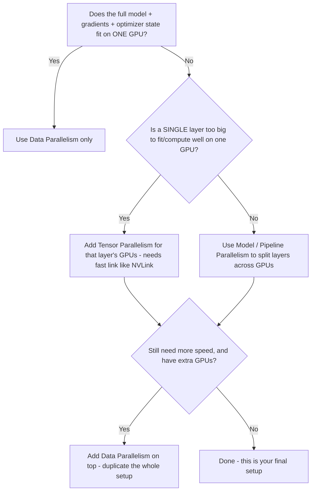

# 12. Choosing a Strategy: A Practical Decision Guide

**Keywords used in this file:** VRAM (the memory built into a GPU, short for Video RAM), Throughput (how much useful work gets done per second, e.g., how many samples processed per second).

---

## Start With One Question: Does the Model Fit?

## Decision Checklist by Situation

### 1. "I have one GPU, or a few GPUs on one machine, and my model fits fine"

- **Use:** Data Parallelism only.
- **Why:** Simplest option, no need for the complexity of splitting the model.

### 2. "My model doesn't fit even with a batch size of 1"

- **Use:** Model or Pipeline Parallelism (split by layers).
- **Why:** Only way to reduce memory per GPU, since data parallelism doesn't help with memory.
- **Prefer Pipeline over plain Model Parallelism** if you can, since pipelining keeps GPUs busier (fewer idle "bubbles").

### 3. "My model fits, but a single layer (like a huge attention layer) is the problem"

- **Use:** Tensor Parallelism, for that layer or group of layers, **only if the GPUs involved are connected with a fast link** (like NVLink inside one machine).
- **Why:** Tensor parallelism needs very frequent, fast communication — don't use it across a slow network.

### 4. "I have many machines, some with fast internal links, some connected by regular network"

- **Use:** Hybrid — Tensor Parallelism within each machine (fast link), Pipeline Parallelism across machines (slower link is OK), and Data Parallelism to duplicate the whole thing if you have spare machines.
- **Why:** Matches each technique's communication needs to the actual hardware speed available.

### 5. "I have low-power / smaller GPUs mixed with stronger ones"

- Give **weaker GPUs fewer layers**, or the lighter/simpler layers.
- Give **stronger GPUs the heavier layers** (large matrix multiplications, like attention blocks).
- Balance by estimated **compute time per GPU**, not just equal layer count — otherwise the weakest GPU becomes the bottleneck for the whole pipeline.

### 6. "I care about inference (serving the model), not training"

- You don't need gradients or optimizer states in memory, so memory needs are lower than training.
- Still, if the model itself is too large for one GPU, use **Tensor Parallelism** (very common for serving large models, since it keeps response time low by using GPUs in parallel) or **Pipeline Parallelism** (better for very high-throughput serving, less concerned about instant response time).
- Data Parallelism at inference just means running multiple identical copies of the model to serve more users at once — simple and commonly used alongside the above.

## Quick Reference Table

| Situation | Recommended Technique |
|---|---|
| Model fits on 1 GPU, want speed | Data Parallelism |
| Model too big, layers can be grouped | Model / Pipeline Parallelism |
| Single layer too big, fast link available | Tensor Parallelism |
| Large cluster, mixed fast/slow links | Hybrid (Tensor + Pipeline + Data) |
| Mixed GPU strengths | Uneven layer split, matched to GPU power |
| Serving a large model (inference) | Tensor and/or Pipeline Parallelism, plus Data Parallelism for more users |

## Final Advice

Don't over-engineer. Many real, successful training setups use nothing more than Data Parallelism, because their model comfortably fits on their GPUs. Only reach for Model, Tensor, Pipeline, or Hybrid Parallelism when your model size or a single layer's size actually forces you to — each added technique brings real complexity and more ways for things to fail (see file 08).

---

**Back to:** [README.md](./README.md)
